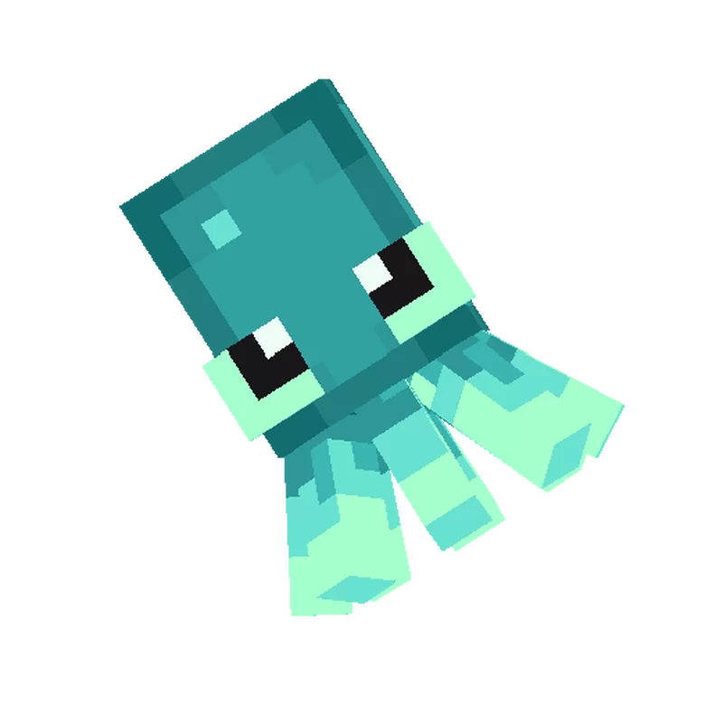

# mineSquid

   
  

  

# Описание:
Проект, который поможет вам переключаться между модпаками в майнкрафте. Для этого поместите все ваши модпаки в папку %appdata%/mineSquid/modpacks* (папка доступна с рабочего стола или из меню пуск, ярлык - Папка с модпаками). 
*каждый модпак должен находиться в своей собственной папке (например:  /../../minesquid/modpacks/modpack1,  /../../minesquid/modpacks/modpack228,  или /../../minesquid/modpacks/super-puper-modpack) 

<h1>Навигация:</h1>

### [# Описание](#описание)
### [# Установка](#установка)
### [# Инструкция](#инструкция)
### [# Галерея](#галерея)

# Установка:
<h4>Метод первый:</h4>

1. Установите программу с помощью winget: 
&nbsp;&nbsp;&nbsp;&nbsp;<code>winget install mineSquid</code> 
2. Ознакомьтесь с инструкцией ниже 
3. ПРОФИТ! 
 
<h4>Метод второй:</h4>

1. Скачайте установщик 
2. Установите программу 
3. Запустите программу. Она автоматически создаст все необходимые для работы папки. 
4. Ознакомьтесь с инструкцией ниже 
5. ПРОФИТ 

# Инструкция:

1. Откройте программу  
2. Назначьте папку с игрой. Для этого перейдите на вкладку "Настройки", нажмите обзор и выберите папку, где расположена игра Minecraft.
Затем нажмите "Применить"  
3. Подготовьте модпаки. Для этого нажмите кнопку с изображением папки в нижней части интерфейса программы. У вас откроется папка modpacks. В ней необходимо создать папки с назвниями, отражающими предназанчение модпака, например "1.12.2 pvp" или 
"1.22.2 hardcore survival". В каждую из этих папок поместите jar файлы необходимых модов. Теперь обновите данные о модпаках. Для этого нажмите кнопку с круглой стрелкой в нижней части интерфейса программы. Список ваших модпаков должен отобразится на вкладке "Главная"  
4. Выберите необходимый модпак, щелкнув по нему, затем нажмите кнопку GO. После этого все моды, находящиеся в выбранном модпаке будут помещены в папку mods, находящуюся в папке с игрой. При этом всё содержимое этой папки будет удалено. 
\* Чтобы восстановить все содержимое папки mods, удаленное при загрузке выбранного модпака, нажмите кнопку с круглой стрелкой и часами (кнопка восстановления) в нижней части интерфейса программы.  
\** Если вы нажали кнопку восстановления случайно, нажмите ее повторно, чтобы вернуть все как было  
5. Если вам нужны (или наоборот - не нужны) оповещения об успешной загрузке модпака или восстановлении резервной копии (с помощью кнопки восстановления), вы можете настроить их отображение на вкладке "Настройки". По завершению настройки, не забывайте нажимать кнопку "Применить"

# Галерея:

Главная

 

Логи

 

Настройки

 

Диалоговые окна

 

